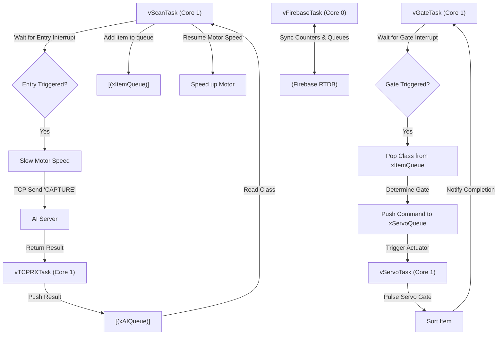
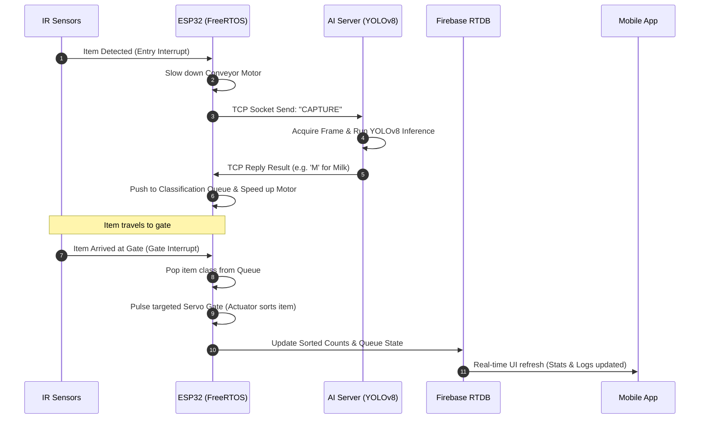

# 🚀 Smart Conveyor Product Classification System (AI + IoT + Cloud)

<div align="center">

[](https://en.cppreference.com/)
[](https://platformio.org/)
[](https://firebase.google.com/)
[](https://docs.ultralytics.com/)
[](https://reactnative.dev/)
[](LICENSE)

**An automated cyber-physical product sorting system combining high-speed computer vision, multi-core FreeRTOS scheduling, and real-time cloud synchronization.**

[Architecture](#-system-architecture) • [Task Layout](#-freertos-task-architecture) • [Sequence](#-sequence-diagram) • [Installation](#-installation--setup) • [Limitations](#-known-limitations--future-improvements)

</div>

---

## 📖 Project Overview

This repository hosts the code for an **Automated Product Classification Conveyor Belt** system. It integrates high-speed edge computer vision inference, concurrent microcontroller task execution, and real-time mobile visualization:

* 🤖 **Edge AI Vision**: Replaces traditional static color/optical sensors with **YOLOv8/v11** classification.
* ☁️ **Cloud Database**: Synchronizes sorting state and stats bidirectionally via **Firebase Realtime Database**.
* 📱 **Mobile Interface**: Provides a premium **React Native (Expo)** mobile application for remote system control and real-time counts.
* 🎛️ **RTOS Firmware**: Utilizes **ESP32 (FreeRTOS)** to schedule motor controls, sensor interrupts, and servo gates concurrently.

---

## 🏗️ System Architecture

The following diagram maps the integration between local physical sensors, FreeRTOS tasks, the Edge AI server, and the Firebase cloud client:

```mermaid
graph TD
    subgraph Physical Hardware
        cam[📷 OV2640 Camera]
        ir1[⚡ IR Entry Sensor - Pin 13]
        ir2[⚡ IR Gate Sensor - Pin 23]
        motor[⚙️ DC Conveyor Motor - Pin 25]
        s1[🦾 Servo 1 - Fruit Gate - Pin 27]
        s2[🦾 Servo 2 - Milk Gate - Pin 32]
        lcd[📟 16x2 I2C LCD - Pin 21/22]
    end

    subgraph ESP32 Controller (FreeRTOS Core)
        isr[IR Interrupt Handler]
        mq[Motor Speed Queue]
        aq[AI Class Queue]
        iq[Item Sorting Queue]
        sq[Servo Commands Queue]
    end

    subgraph Edge AI Server (PC)
        tcp[🔌 TCP Socket Server :8888]
        yolo[🧠 YOLOv8 Inference Engine]
    end

    subgraph Cloud & Client
        fb[(🔥 Firebase RTDB)]
        app[📱 React Native Mobile App]
    end

    ir1 -->|FALLING Interrupt| isr
    ir2 -->|FALLING Interrupt| isr
    isr -->|Event Group Trigger| mq
    mq -->|Adjust speed| motor
    
    cam -->|Video Frames| yolo
    isr -->|Send CAPTURE| tcp
    tcp -->|Run Model| yolo
    yolo -->|Return 'A'/'B'/'O'/'M'| tcp
    tcp -->|Send Result| aq
    aq -->|Queue Classification| iq
    iq -->|Triggers sorting at Gate| sq
    sq -->|Activate Gate 1| s1
    sq -->|Activate Gate 2| s2
    
    sq -->|Update LCD state| lcd
    
    esp_rtdb_sync[Firebase Client Task] <-->|Real-time state sync| fb
    fb <-->|Control & Monitor| app
```

---

## ✨ Key Features

### 🔍 Edge Computer Vision
* Replaces optical sensors with a custom YOLO model capable of classifying multiple items (Apple, Banana, Orange, Milk) with high confidence.
* Features a temporal confirmation filter (takes 4 inference frames and accepts the majority vote) to mitigate image noise and motion blur.

### ⚡ Concurrent Task Scheduling (FreeRTOS)
* **Preemptive Scheduling**: Allocates tasks across ESP32's dual cores (Core 0 for Wi-Fi and Firebase sync; Core 1 for motor, servo control, and interrupts).
* **Interrupt-Driven**: IR sensors use GPIO ISRs (`FALLING` edge triggers) that communicate with control threads using Event Groups and Binary Semaphores.
* **Intelligent Sorting Queue**: Implements an in-memory queue to track physical items traveling between the entry camera and the sorting gates, preventing collisions when multiple objects are on the belt.

### ☁️ Bidirectional Cloud Sync
* Synchronizes physical button inputs (mode switches, motor stops) and remote mobile dashboard requests with sub-second latency.
* Preserves counts locally via ESP32 `Preferences` non-volatile storage to prevent data loss on power resets.

---

## 🔌 GPIO Connection Mapping

| Component | ESP32 GPIO | Mode | Protocol / Description |
|:---|:---:|:---:|:---|
| DC Motor PWM (Speed) | 25 | Output | LEDC PWM (5kHz) |
| DC Motor Direction | 26 | Output | GPIO Digital |
| Servo 1 (Fruit Gate) | 27 | Output | PWM (50Hz) |
| Servo 2 (Milk Gate) | 32 | Output | PWM (50Hz) |
| IR Entry Sensor | 13 | Input | ISR Pin (FALLING Interrupt) |
| IR Gate Sensor | 23 | Input | ISR Pin (FALLING Interrupt) |
| LCD SDA | 21 | I/O | I2C Data |
| LCD SCL | 22 | Output | I2C Clock |
| POWER Button | 16 | Input | Pull-up Input (Debounced) |
| MODE Button | 15 | Input | Pull-up Input (Debounced) |
| MOTOR Button | 17 | Input | Pull-up Input (Debounced) |

---

## 🛠️ FreeRTOS Task Architecture

The conveyor belt's concurrency model handles high-frequency events without blocking the main CPU execution:



---

## ⏱️ Sequence Diagram

The following diagram maps the step-by-step sequence of operations during a product classification cycle:



---

## ⚙️ Installation & Setup

### 1️⃣ Firmware Compilation (ESP32)
The project is configured for **PlatformIO**. You can build it directly using the provided `Makefile`:

```bash
# Compile and build the binary firmware
make build-firmware
```

If you are using the Arduino IDE:
1. Copy the files in `src/` and `include/` into your Arduino sketch directory.
2. Install dependencies: `LiquidCrystal_I2C`, `ESP32Servo`, and `Firebase_ESP_Client`.
3. Select board `ESP32 Dev Module` and flash.

### 2️⃣ Python AI Server Setup
Install dependencies and run the TCP server:

```bash
# Install virtual environment and packages
make install

# Start the TCP YOLO Camera server
make run-server
```

### 3️⃣ Mobile Application (React Native)
Deploy the Expo-based mobile interface:

```bash
cd bangchuyen-app
npm install
npm run android # or npm run ios
```

---

## ⚠️ Known Limitations & Future Improvements

1. **TCP Network Blocking**: The communication between ESP32 and the Python server uses raw TCP sockets. If the Wi-Fi link experiences high latency or drops packets, the TCP read/write buffer blocks, causing items to pass the entry sensor without being scanned.
   * *Future Path*: Migrate the socket write logic to a non-blocking asynchronous socket queue or leverage UDP with validation frames.
2. **Database Write Quotas**: Direct, high-frequency updates to Firebase RTDB can hit rate limits or increase billing costs under heavy sorting cycles.
   * *Future Path*: Implement local batching or delta-only transfers (sending changes only when counts increment).
3. **Edge Processing Constraints**: Running inference on a separate PC requires active network connectivity.
   * *Future Path*: Optimize and prune the YOLO model to compile as a TensorFlow Lite Micro or Edge Impulse library, running model inference directly on an ESP32-S3 or STM32 MCU at the edge.
4. **Mechanical Gate Latency**: High-velocity conveyor speeds might result in products arriving at the gate before the servo completes its sweep.
   * *Future Path*: Introduce dynamic servo speed controls modulated by conveyor speed measurements.
