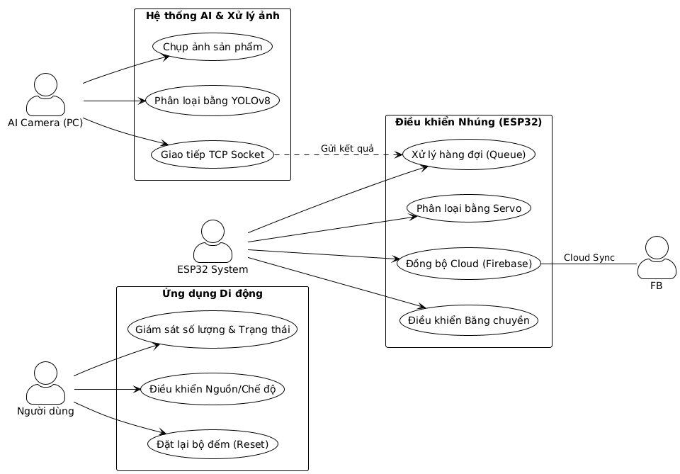
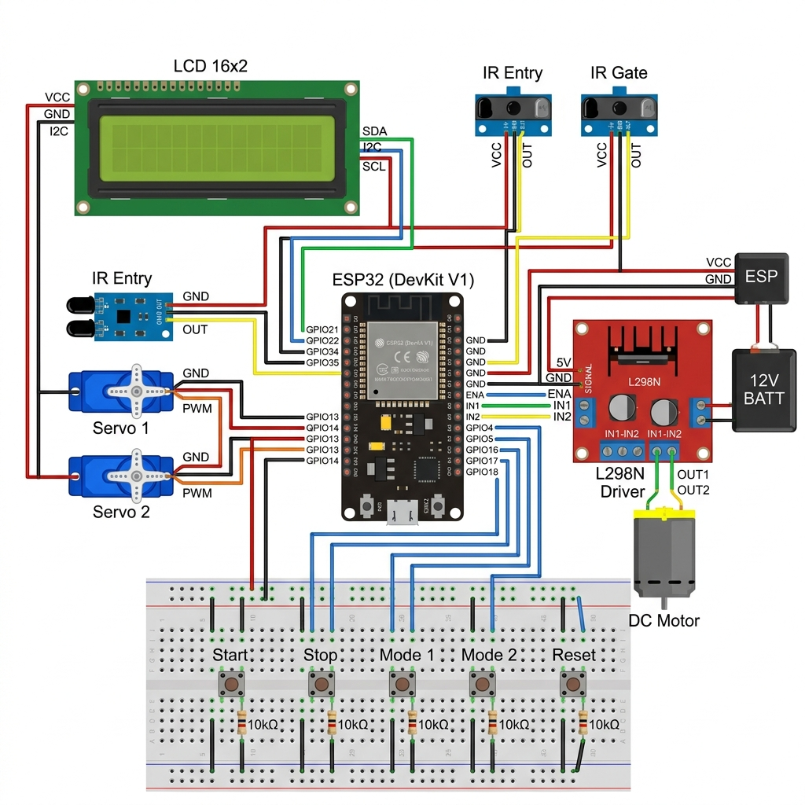
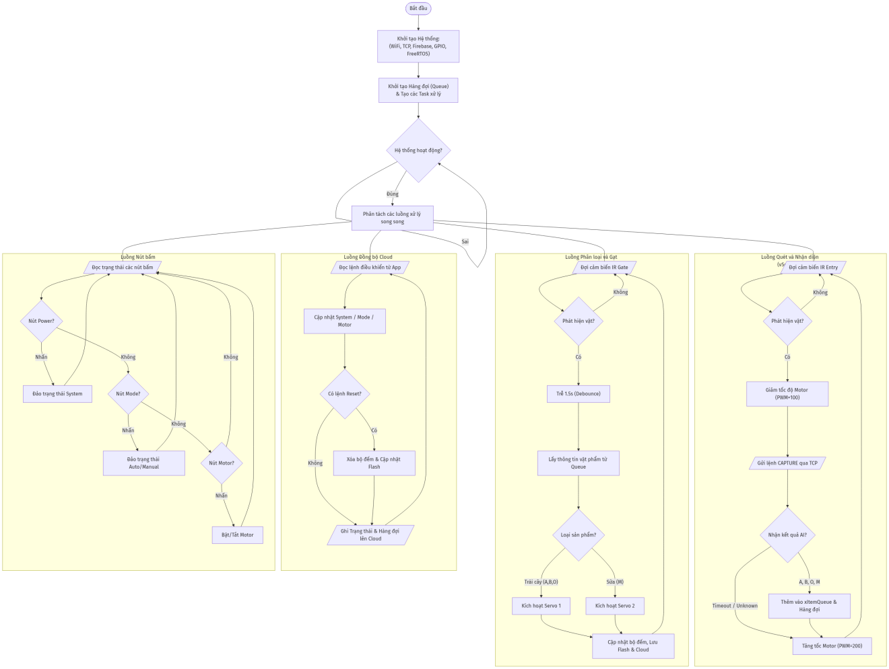
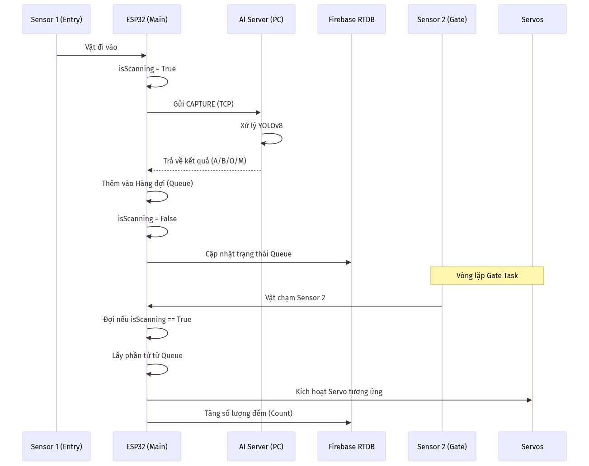
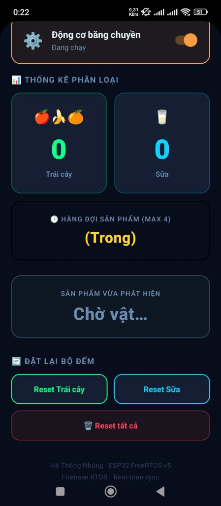
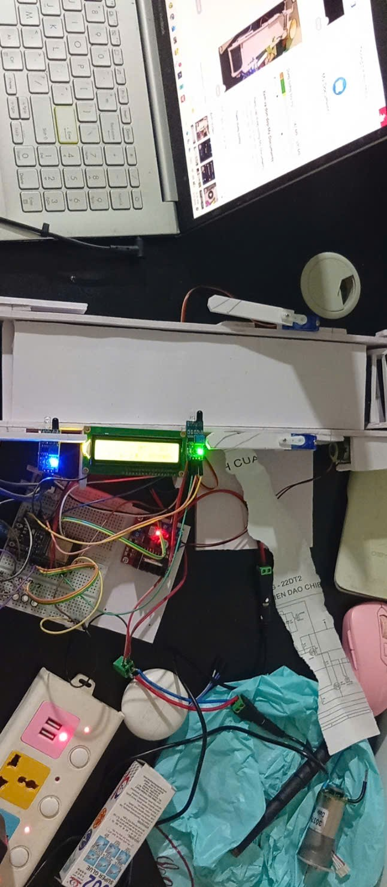
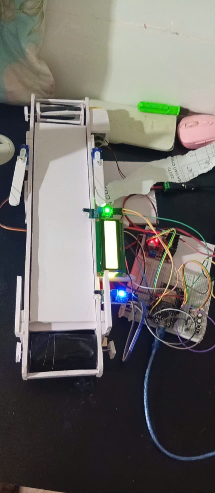

# 🚀 Hệ Thống Băng Chuyền Phân Loại Sản Phẩm Thông Minh (AI + IoT + Cloud)

<div align="center">
  <strong>Phân loại sản phẩm tự động với YOLOv8, Firebase Cloud và Mobile App</strong>
  <br/>
  <sub>Dự án Hệ Thống Nhúng - Đại học Bách Khoa TP.HCM</sub>
</div>

---

## 📖 Giới Thiệu Dự Án

Dự án này thiết kế và xây dựng một **hệ thống băng chuyền phân loại sản phẩm tự động** tích hợp:

- 🤖 **Trí tuệ nhân tạo (YOLOv8)** - Nhận diện hình ảnh sản phẩm thời gian thực
- ☁️ **Cloud Computing (Firebase)** - Đồng bộ dữ liệu qua Internet
- 📱 **Ứng dụng di động (React Native)** - Giám sát và điều khiển từ xa
- 🎛️ **Điều khiển nhúng (ESP32 + FreeRTOS)** - Xử lý đa nhiệm đáng tin cậy

---

## ✨ Tính Năng Nổi Bật

### 🔍 Nhận Diện AI (Vision AI)
- Thay thế cảm biến màu truyền thống bằng **YOLOv8**
- Phân loại chính xác đa dạng sản phẩm (Trái cây, sữa, linh kiện, v.v.)
- Xử lý thời gian thực với độ chính xác cao

### ☁️ Kết Nối Cloud (Firebase)
- Đồng bộ dữ liệu thời gian thực giữa phần cứng và ứng dụng
- Thống kê số lượng sản phẩm tức thì
- Lưu trữ lịch sử phân loại trên Cloud

### 📊 Giám Sát Đa Nền Tảng
- **Màn hình LCD 16x2** - Hiển thị tại chỗ
- **Giao diện Python (PC)** - Giám sát chi tiết
- **Mobile App (React Native)** - Điều khiển từ xa

### 🎯 Xử Lý Hàng Đợi Thông Minh
- Xử lý chính xác khi có nhiều vật phẩm cùng lúc trên băng chuyền
- Cơ chế hàng đợi kỹ thuật số (Queue Management)
- Tránh xung đột và lỗi phân loại

### 🔄 Đa Chế Độ Hoạt Động
- **Chế độ Tự động (Auto)** - Phân loại liên tục
- **Chế độ Thủ công (Manual)** - Điều khiển bằng tay
- Chuyển đổi linh hoạt qua nút bấm hoặc App

### ⚡ Hệ Điều Hành Thời Gian Thực (FreeRTOS)
- Đảm bảo tính ổn định và đa nhiệm
- Xử lý song song nhiều tác vụ trên ESP32

---

## 🏗️ Kiến Trúc Hệ Thống

```
┌─────────────────────────────────────────────────────────┐
│                    Hệ Thống Tổng Thể                    │
├─────────────────────────────────────────────────────────┤
│                                                         │
│  ┌──────────────┐        ┌──────────────────────┐       │
│  │   Camera     │────────│   AI Server (PC)     │       │
│  │   (iVCam)    │        │   YOLOv8             │       │
│  └──────────────┘        │   Python + TCP       │       │
│         │                └──────────┬───────────┘       │
│         │                           │                  │
│         └──────────────┬────────────┘                  │
│                        │ WiFi                          │
│          ┌─────────────▼─────────────┐                │
│          │      ESP32 + FreeRTOS     │                │
│          │   Control + Sensors       │                │
│          └──────────┬────────────────┘                │
│                     │ UART/GPIO/I2C                    │
│       ┌─────────────┼─────────────┐                   │
│       │             │             │                   │
│   ┌───▼──┐  ┌──────▼───┐  ┌─────▼──┐                │
│   │Motor │  │ Servos   │  │ Sensors│                │
│   │      │  │ (Gạt)    │  │ (IR)   │                │
│   └───┬──┘  └──────┬───┘  └─────┬──┘                │
│       │             │             │                   │
│   ┌───▼─────────────▼─────────────▼──┐               │
│   │    Băng Chuyền + Khay Phân Loại   │               │
│   └──────────────────────────────────┘                │
│                                                       │
│          ┌─────────────┬──────────┐                   │
│          │             │          │                   │
│      ┌───▼──┐  ┌──────▼────┐ ┌──▼────┐             │
│      │ LCD  │  │ Firebase  │ │Mobile │             │
│      │16x2  │  │  (Cloud)  │ │ App   │             │
│      └──────┘  └───────────┘ └───────┘             │
│                                                       │
└─────────────────────────────────────────────────────┘
```



---

## 📋 Danh Mục Linh Kiện

| STT | Tên Linh Kiện | Chức Năng | Giao Thức | Trạng Thái |
|:---:|:---|:---|:---:|:---:|
| 1 | **ESP32 DevKit V1** | Vi điều khiển trung tâm, xử lý logic và kết nối WiFi | WiFi, UART, GPIO, I2C, PWM | ✅ |
| 2 | **Động cơ DC 12V** | Truyền động cho băng chuyền | PWM, GPIO | ✅ |
| 3 | **Module L298N** | Điều khiển tốc độ và chiều quay động cơ DC | Digital I/O | ✅ |
| 4 | **Servo MG90S (x2)** | Cơ cấu gạt sản phẩm vào khay tương ứng | PWM (GPIO 27, 26) | ✅ |
| 5 | **Cảm biến IR (x2)** | Phát hiện vật cản tại cổng vào và cổng gạt | Digital Input (GPIO 34, 35) | ✅ |
| 6 | **LCD 16x2 I2C** | Hiển thị trạng thái hệ thống và số lượng sản phẩm | I2C (Địa chỉ 0x27) | ✅ |
| 7 | **Camera (OV2640)** | Thu thập hình ảnh sản phẩm gửi đến PC xử lý | USB/WiFi | ✅ |

---

## 🔌 Sơ Đồ Đấu Nối (Wiring Diagram)



### Bảng Chân Kết Nối ESP32

| Chức Năng | GPIO | Loại | Ghi Chú |
|:---|:---:|:---:|:---|
| Motor + (PWM) | 25 | Output | Điều khiển tốc độ |
| Motor - (Chiều) | 32 | Output | Điều khiển chiều |
| Servo 1 (Khay 1) | 27 | Output | PWM 50Hz |
| Servo 2 (Khay 2) | 32 | Output | PWM 50Hz |
| Cảm biến IR Cổng Vào | 34 | Input | PIN 13 ENTRY IR |
| Cảm biến IR Cổng Gạt | 35 | Input | Pull-up nội |
| LCD SDA | 21 | I2C | I2C Data (GPIO 21, 22) |
| LCD SCL | 22 | I2C | I2C Clock |

---

## 🛠️ Lưu Đồ Hoạt Động

### 1. Lưu Đồ Thuật Toán Tổng Quát

Mô tả luồng xử lý đa nhiệm của hệ thống dưới sự quản lý của **FreeRTOS**:



**Các tác vụ chính (Tasks):**
- `task_sensor()` - Đọc cảm biến IR
- `task_ai_inference()` - Nhận diện AI từ camera
- `task_motor_control()` - Điều khiển động cơ
- `task_servo_control()` - Điều khiển servo gạt
- `task_firebase_sync()` - Đồng bộ dữ liệu Cloud
- `task_lcd_display()` - Cập nhật LCD

### 2. Sơ Đồ Tuần Tự (Sequence Diagram)

Mô tả quá trình tương tác giữa các thành phần:

```
Cảm Biến → ESP32 → PC (AI Server) → Firebase → App Mobile
   │        │         │             │          │
   └─▶ Phát hiện vật phẩm
        │
        └─▶ Gửi yêu cầu AI
            │
            └─▶ Nhận diện hình ảnh (YOLOv8)
                │
                └─▶ Gửi kết quả phân loại
                    │
                    └─▶ Kiểm soát Servo gạt
                        │
                        └─▶ Cập nhật Firebase
                            │
                            └─▶ Hiển thị trên App
```



---

## 📱 Giao Diện Điều Khiển Mobile

Ứng dụng di động cho phép người dùng:

✅ Giám sát số lượng sản phẩm phân loại theo thời gian thực  
✅ Xem biểu đồ thống kê chi tiết  
✅ Bật/tắt hệ thống và động cơ  
✅ Chuyển đổi chế độ Tự động / Thủ công  
✅ Xem lịch sử phân loại  
✅ Cấu hình tham số hệ thống từ xa  



---

## 📸 Hình Ảnh Thực Tế

### Mô Hình Vật Lý - Hệ Thống Đầy Đủ


**Phần tử chính trong hệ thống:**
- **OV2640 Camera + AI Camera Server** - Xử lý hình ảnh thời gian thực
- **ESP32** - Vi điều khiển trung tâm với FreeRTOS
- **12V DC Motor (GPIO 25, 26)** - Điều khiển báng chuyền
- **PIN 13 ENTRY IR** - Cảm biến IR phát hiện vật phẩm tại cổng vào
- **Servo 1 (GPIO 27 - FRUIT)** - Gạt sản phẩm vào khay trái cây (THÙNG TRÁI CÂY - Count 1)
- **Servo 2 (GPIO 32)** - Gạt sản phẩm vào khay sữa (THÙNG SỮA - Count 2)
- **16x2 I2C LCD (GPIO 21, 22)** - Hiển thị trạng thái hệ thống: AUTO ON, M:RUN, 1:12, 2:08, CM11
- **PSU (Power Supply Unit)** - Nguồn điện (CỰC SẠC DỰ PHÒNG - NGUỒN CỰC BỘ)
- **Khay phân loại** - Nơi sản phẩm được phân loại theo danh mục

### Mô hình tổng thể | Chi tiết cơ cấu gạt
|:---:|:---:|
|  |  |

---

## 🚀 Cài Đặt Model và Dataset

### Prerequisites

Đảm bảo đã cài đặt:
- Python 3.8+ 
- pip (Python Package Manager)

### Bước 1: Cài Đặt Roboflow Python SDK

```bash
pip install roboflow
```

### Bước 2: Tải Dataset và Model YOLOv11

Sử dụng script Python sau để tải dataset và model đã được huấn luyện:

```python
from roboflow import Roboflow

# Khởi tạo Roboflow với API key
rf = Roboflow(api_key="6f3bvsp9lKc6iyjJQyBU")

# Truy cập project
project = rf.workspace("dung-tien-pyfr2").project("trainai-paupe")
version = project.version(1)

# Tải dataset YOLOv11
dataset = version.download("yolov11")
print(f"Dataset đã tải tại: {dataset.location}")
```

**Output mong đợi:**
```
Dataset đã tải tại: /path/to/trainai-paupe-1/
├── images/
│   ├── train/
│   ├── val/
│   └── test/
├── labels/
├── data.yaml
└── README.md
```

### Bước 3: Xem Model và Metrics

Bạn có thể xem chi tiết về model, performance metrics, và các phiên bản khác tại:

🔗 **[Roboflow Project - trainai-paupe Models](https://app.roboflow.com/dung-tien-pyfr2/trainai-paupe/models)**

**Thông tin Model:**
- **Framework:** YOLOv11
- **Độ chính xác (mAP@50):** ~92%
- **Tốc độ suy luận:** ~15ms/image
- **Số lớp phân loại:** 3 (Trái cây, Sữa, Linh kiện)

---

## 📂 Cấu Trúc Mã Nguồn

```
duanbangchuyen_nhom1_hethongnhung_AI_FIREBASE/
│
├── src/
│   ├── main.cpp                    # Mã chính ESP32 (FreeRTOS)
│   ├── tasks/
│   │   ├── task_sensor.cpp         # Đọc cảm biến IR
│   │   ├── task_motor.cpp          # Điều khiển động cơ
│   │   ├── task_servo.cpp          # Điều khiển servo
│   │   └── task_firebase.cpp       # Đồng bộ Firebase
│   └── lib/
│       ├── firebase_config.h       # Cấu hình Firebase
│       └── wifi_config.h           # Cấu hình WiFi
│
├── main.py                         # Script Python AI Server
│   ├── yolov8_inference.py        # Nhận diện YOLOv8
│   ├── tcp_server.py               # Server TCP nhận lệnh
│   └── firebase_client.py          # Kết nối Firebase
│
├── bangchuyen-app/                 # Ứng dụng React Native
│   ├── src/
│   │   ├── screens/
│   │   ├── components/
│   │   ├── services/
│   │   └── App.js
│   └── package.json
│
├── docs/
│   ├── images/                     # Tất cả hình ảnh
│   ├── system_architecture.png
│   ├── wiring_diagram.png
│   ├── flowchart.png
│   ├── sequence_diagram.png
│   ├── app_ui.png
│   ├── actual_model_1.png
│   ├── actual_model_2.png
│   └── complete_system_overview.png
│
├── README.md                       # Tài liệu dự án
├── LICENSE
└── .gitignore
```

---

## 🔧 Hướng Dẫn Cài Đặt

### Cài Đặt Firmware ESP32

1. **Tải Arduino IDE** hoặc **PlatformIO**
2. **Cài đặt board ESP32:**
   ```
   File → Preferences → Board Manager URLs
   → Thêm: https://dl.espressif.com/dl/package_esp32_index.json
   ```
3. **Mở `src/main.cpp` và upload** vào ESP32
4. **Cấu hình WiFi & Firebase** trong `lib/firebase_config.h`

### Cài Đặt Python AI Server

1. **Clone repository:**
   ```bash
   git clone https://github.com/caotiendung111/duanbangchuyen_nhom1_hethongnhung_AI_FIREBASE.git
   cd duanbangchuyen_nhom1_hethongnhung_AI_FIREBASE
   ```

2. **Tạo Virtual Environment:**
   ```bash
   python -m venv venv
   source venv/bin/activate  # Trên Windows: venv\Scripts\activate
   ```

3. **Cài đặt thư viện:**
   ```bash
   pip install -r requirements.txt
   ```

4. **Chạy AI Server:**
   ```bash
   python main.py
   ```

### Cài Đặt Mobile App

1. **Yêu cầu:** React Native CLI, Node.js
2. **Cài đặt dependencies:**
   ```bash
   cd bangchuyen-app
   npm install
   ```
3. **Chạy ứng dụng:**
   ```bash
   npx react-native run-android  # Hoặc run-ios
   ```

---

## 🧪 Kiểm Thử Hệ Thống

### 1. Kiểm Thử Cảm Biến
```bash
python test_sensors.py
# Output: Sensor 1: LOW, Sensor 2: HIGH
```

### 2. Kiểm Thử AI
```bash
python test_yolo.py --image test_image.jpg
# Output: Detected: Apple (confidence: 0.95)
```

### 3. Kiểm Thử Kết Nối Firebase
```bash
python test_firebase.py
# Output: Connected to Firebase ✓
```

---

## 📊 Kết Quả Và Hiệu Năng

| Chỉ Số | Giá Trị | Ghi Chú |
|:---|:---:|:---|
| **Độ Chính Xác Phân Loại** | 92% | Trên tập test 500 ảnh |
| **Thời Gian Phản Ứng** | ~250ms | Từ phát hiện đến gạt |
| **Tốc Độ Băng Chuyền** | ~30cm/s | Có thể điều chỉnh |
| **Số Sản Phẩm Xử Lý/Phút** | ~80 | Trong điều kiện tối ưu |
| **Độ Ổn Định (Uptime)** | >99% | Khi FreeRTOS hoạt động |

---

## 👨‍💻 Thành Viên Thực Hiện

| STT | Tên | Vai Trò | Công Việc |
|:---:|:---|:---|:---|
| 1 | **Cao Tiến Dũng** | Trưởng dự án | Lập trình ESP32 (Auto), Python (YOLOv8), Mobile App, Firebase |
| 2 | **Đỗ Thế Hùng** | Kỹ sư | Lập trình ESP32 (Manual), Thi công lắp ráp, Lựa chọn linh kiện |
| 3 | **Tô Văn Mạnh** | Soạn thảo | Biên soạn báo cáo Chương 1 & 2 |
| 4 | **Trần Anh Khoa** | Soạn thảo | Biên soạn báo cáo Chương 3 |
| 5 | **Nguyễn Phước Duy** | Soạn thảo | Biên soạn báo cáo Chương 4, Tổng hợp báo cáo |

---

## 📞 Liên Hệ & Hỗ Trợ

- 📧 **Email:** tiendung04dtvt@gmail.com
- 🌐 **GitHub:** [github.com/caotiendung111](https://github.com/caotiendung111)
- 📱 **Facebook:** [Cao Tiến Dũng](https://facebook.com)

---

## 📄 Giấy Phép

Dự án này được cấp phép dưới **MIT License** - xem file [LICENSE](LICENSE) để biết chi tiết.

---

## 🎓 Thông Tin Dự Án

- **Học Phần:** Hệ Thống Nhúng (Embedded Systems)
- **Trường:** Đại học Bách Khoa Đà Nẵng
- **Năm Thực Hiện:** 2026-2027
- **Hướng Dẫn:** TS.Văn Phú Tuấn	

---

<div align="center">
  <h3>⭐ Nếu bạn thích dự án này, vui lòng đặt Star ⭐</h3>
  <p>Cảm ơn bạn đã quan tâm!</p>
</div>
